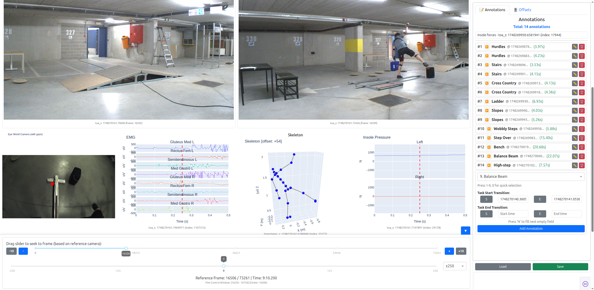

# AidWear Annotation Tool



## File Structure

```
annotation/
├── components/
│   ├── AnnotationComponent.py      # Annotation management UI
│   ├── BaseComponent.py            # Base class for all components
│   ├── FrameSliderComponent.py     # Frame navigation controls
│   ├── GazeComponent.py            # (Not currently used)
│   ├── IMUComponent.py             # IMU sensor visualization
│   ├── __init__.py                 # Component exports
│   ├── InsolePressureComponent.py  # (Not currently used)
│   ├── LinePlotComponent.py        # EMG and Insole data plots
│   ├── OffsetComponent.py          # Synchronization offset controls
│   ├── SaveLoadComponent.py        # Save/Load annotations to HDF5
│   ├── SkeletonComponent.py        # 3D skeleton visualization
│   └── VideoComponent.py           # Video display with gaze overlay
├── multimodal_annotation.py        # Main application entry point
└── sync_utils.py                   # Synchronization utilities
```

### multimodal_annotation.py

**Main entry point**

**Key components:**

1. **App initialization and configuration**

   - Set up data paths, configurations, annotation labels
   - Initialize dash application
2. **Shared state management**

   - Centralized data stores shared across different components, enabling communication between components
3. **Data loading and synchronization**

   - Loads all data components and performs (initial) temporal synchronization
4. **UI Component Assembly:**

   - 2x2 camera grid for four external cameras
   - Two rows for other data components (EMG, Skeleton, Pressure, IMU)
   - Right panel with annotation and offset area
   - Frame navigation slider and controls at the bottom
5. **Cross-component communication:**

   - Centralized click handler to handle clicking any data elements to fetch the timestamp from them
   - Keyboard event for handling keyboard shortcuts
   - Ensures UI updates when data is loaded

### sync_utils.py

**Temporal synchronization**

Aligns data streams to a common reference point (100th frame of reference camera) by finding the closest timestamp match in each component. This is used for setting the reference camera frame slider range and initial display of all components in a synchronized manner.

### Component Files

#### AnnotationComponent.py

**Manages annotation creation, editing, and deletion**

**Key features:**

1. **UI**

   - Annotation cards
   - Input fields for task start/end transitions
   - Add/Edit/Delete controls with confirmation
2. **Keyboard Shortcuts**
3. **Annotation Management**
4. **Callbacks**

   - **Keyboard handler**: Updates label selection and fills timestamp fields
   - **Time button handler**: Captures current timestamp when S/E buttons clicked
   - **Main manager**: Handles add, edit, delete, expand/collapse operations

**Important behaviors:**

- Annotations persist in `annotations-store` for save/load functionality

#### FrameSliderComponent.py

**Controls frame navigation and synchronization across all components**

**Key features:**

1. **Dual Slider**

   - Main slider: Navigate through entire video range
   - Fine slider: Precise control within adjustable window (±100/250/500 frames)
2. **Multiple Navigation Methods**

   - Slider dragging
   - +/- buttons (1 or 10 frame increments)
   - Keyboard shortcuts (arrows, Shift+arrows, Ctrl+arrows, PageUp/Down)
   - All methods update the same central sync timestamp
3. **Synchronization Hub**

   - Converts frame positions to timestamps using reference camera
   - Updates `sync-timestamp` store which triggers all component updates

**Important callback: `update_frame_and_navigate`**

- Handles all navigation inputs and determines new frame position
- Calculates corresponding timestamp from reference camera
- Broadcasts sync signal to all visualization components

#### OffsetComponent.py

**Manages synchronization offsets for fine-tuning temporal alignment**

**Key features:**

1. **Component Grouping**

   - Eye Camera
   - EMG
   - Skeleton/IMU: Shared (both use same value)
   - Insole
2. **How Offsets Work**

   - Offset values are in samples/frames
   - Positive offset: Component shows data from future
   - Negative offset: Component shows data from past
   - Applied during timestamp lookup in each component
3. **Special Behaviors**

   - **Loading from file**: When offsets are loaded, callback detects store change and applies all offsets
   - **Shared offset**: Skeleton/IMU use `skeleton_imu_shared` key, both components get same value

**Notes:**

- Offsets persist in save/load operations
- `offset-update-trigger` increments to force component updates (reflected in the UI)

#### SaveLoadComponent.py

**Handles saving and loading annotations and offsets to/from HDF5 files**

**Key features:**

1. **Save**

   - Saves annotations sorted by start timestamp
   - Saves offsets
   - Returns base64-encoded file for download
2. **Load**

   - Reads annotations from HDF5
   - Loads and applies offsets to components
   - Updates all relevant stores and annotation UI as a result

#### VideoComponent.py

**Displays video frames from cameras with optional gaze overlay for eye camera**

- **Initialization**, including video properties, reference/eye camera flags, gaze visualization flag for eye camera
- **Get video properties** using `_get_video_properties()` - extracts width, height, fps, total frames
- **Read sync metadata** using `_read_sync_metadata()` - loads timestamps/'frame sequence id's from HDF5
- **Read gaze data** using `_read_gaze_data()` (for eye camera only) - loads normalized gaze positions
- **Create the initial layout** with video display and timestamp text
- **Functions:**
  - `_get_frame_at_index()`: Extract specific frame from video file using ffmpeg (uses video timestamp)
  - `_get_gaze_for_frame()`: Find gaze position for given frame and convert to pixel coordinates
  - `get_frame_for_timestamp()`: Find frame index for given timestamp with offset
  - `get_timestamp_at_frame()`: Get timestamp for given frame index
  - `get_sync_info()`: Return synchronization metadata
  - `set_truncation_points()`: Set start/end frames for synchronized playback
  - `get_truncated_frame_count()`: Return number of frames after truncation
- **Callbacks:** Handle frame updates based on slider position (for reference camera) or sync-timestamp (for other cameras), with gaze overlay rendering for eye camera

#### LinePlotComponent.py

**Visualizes time-series data for EMG and Insole pressure measurements**

- **Initialization of variables**, including sampling rate, plot window, channel names for display
- **Read HDF5 data** using `_read_data()` function - handles both burst data (EMG) and continuous data (Insole)
- **Handle burst data** using `_create_interpolated_timestamps()` - EMG data comes in bursts, timestamps interpolated
- **Set min-max range** of the plots (percentile-based)
- **Create the initial layout** with multi-channel line plots
- **Functions:**
  - `get_timestamp_for_sync()`: Find data index for given reference frame timestamp - handles burst and continuous data differently
  - `_create_figure()`: Create multi-channel line plot with time window and current position marker
  - `set_truncation_points()`: Set start/end indices - converts burst indices to sample indices for EMG
- **Callbacks:** Handle updates from sync-timestamp changes or offset value changes

#### SkeletonComponent.py

**Visualizes 3D skeleton data from motion capture**

- **Initialization of variables**, including segment names and skeletal connections
- **Read HDF5 data**
- **Create the initial layout** with 3D skeleton visualization
- **Functions:**
  - `get_timestamp_for_sync()`: Find data index for given reference frame timestamp and apply offset
  - `_create_figure()`: Create the 3D skeleton figure for given frame index
- **Callbacks:** Handle change for change of the slider via sync-timestamp or change due to change in offset value

#### IMUComponent.py

**Visualizes IMU sensor data (accelerometer, gyroscope, magnetometer) for 17 body joints**

- **Initialization of variables**, including joint names
- **Read HDF5 data**
- **Set min-max range** of the plots (percentile-based)
- **Create the initial layout** with the default joint (Pelvis)
- **Functions:**
  - `get_timestamp_for_sync()`: Find data index for given reference frame timestamp and apply offset
  - `_create_figure()`: Create the figure given the center index and the joint index. Creates three subplots for X, Y, and Z axes
- **Callbacks:** Handle change for change of the slider via sync-timestamp, change of value in the dropdown, or due to change in offset value
- **Offset callback flow example:**
  ```python
  # When offset changes:
  1. OffsetComponent sets: imu_component.set_sync_offset(15)
  2. offset-update-trigger increments → triggers callback
  3. Callback calls: self.get_timestamp_for_sync(sync_timestamp)
  4. Inside get_timestamp_for_sync:
     closest_idx = find_closest_timestamp()
     offset_idx = closest_idx + self._sync_offset  # ← Offset applied here!
  5. Returns figure centered at offset position
  ```
